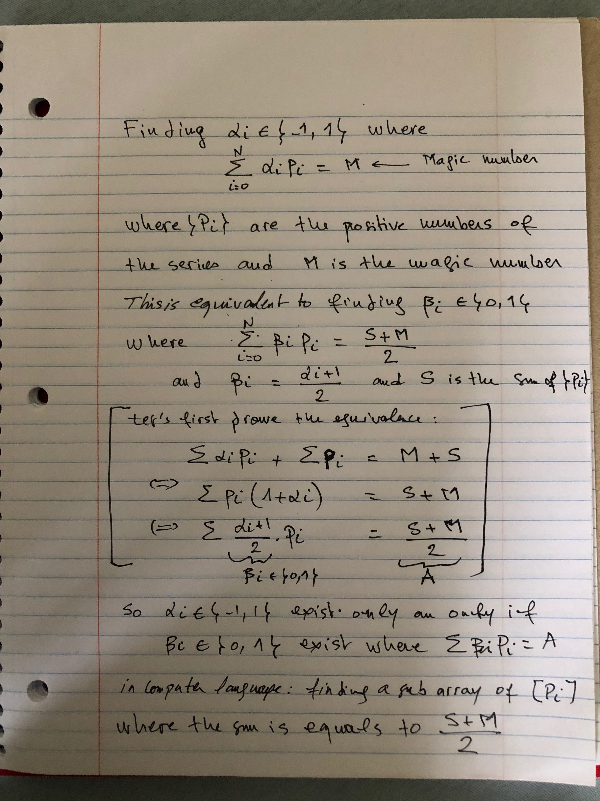

# Problem 1
Write a function that takes a magic number and a list of numbers. It returns true if it can insert add or subtract operations in the list of numbers to get the magic number. Otherwise, it returns false.

# Solution 1

This is equivalent to say: find a sub array in a list of numbers where the sum of this subset equals to (S + M) / 2. Where S is the sum of all numbers and M is the magic number we are looking for.
For example finding the magic number 2 by subtracting or adding numbers from [1, 2, 3, 4] is the same as finding 6 = [(S + M) / 2] by adding 1 or more numbers from the list.

[See Algorithm](https://github.com/mloukili/math/blob/master/Algorithm.java)

## Mathematical Proof

